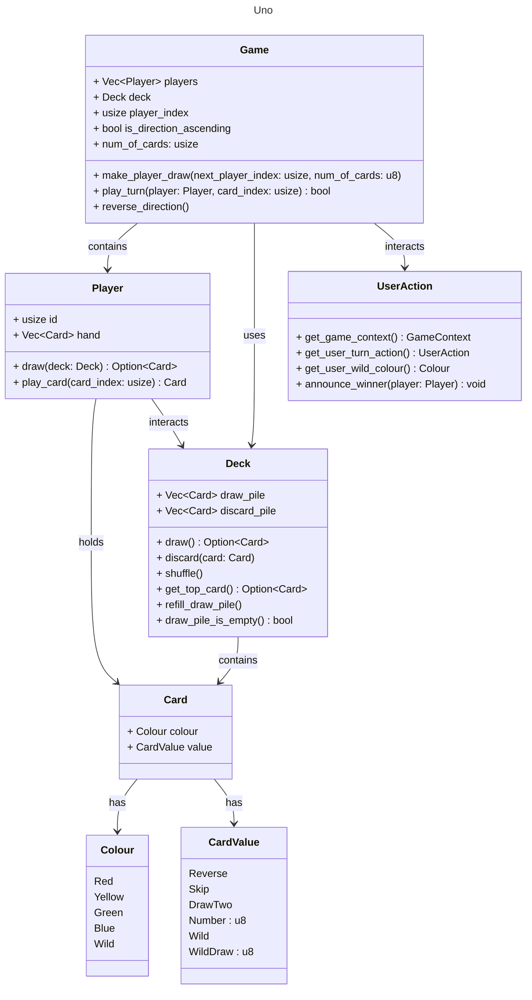

# UNO Game Documentation

## Overview

This document explains the architecture and implementation details of the UNO game. It covers the major components such as cards, the deck, players, and game logic. The game is designed in Rust, leveraging enums, structs, and functions to handle game mechanics, user interaction, and the flow of the game.

## Key Components

The core components of the game are:

1. **Card**: Represents an individual card in the UNO game.
2. **Deck**: Manages the draw and discard piles.
3. **Player**: Each player holds a hand of cards and can perform actions like drawing and playing cards.
4. **Game**: Manages the overall game flow, including the sequence of turns, direction of play, and special card effects.
5. **UserAction**: Handles user input through the command-line interface (CLI), including selecting actions and colors for wildcards.

## Class Diagram

Below is a class diagram that illustrates the relationships between the major components in the game:

## Detailed Components

### Card

The `Card` struct represents a card in the game and contains:
- `colour`: A `Colour` enum representing the color of the card (Red, Yellow, Green, Blue, Wild).
- `value`: A `CardValue` enum representing the type of card (e.g., `Reverse`, `Skip`, `DrawTwo`, `Number(u8)`, `Wild`, or `WildDraw(u8)`).

### Deck

The `Deck` struct manages the deck of cards. It contains two piles:
- `draw_pile`: A vector (`Vec<Card>`) representing the remaining deck from which players draw cards.
- `discard_pile`: A vector (`Vec<Card>`) representing the pile where played cards are discarded.

Key methods include:
- `draw()`: Returns an `Option<Card>` by popping a card from the draw pile.
- `discard(card: Card)`: Adds a card to the discard pile.
- `shuffle()`: Shuffles the draw pile.
- `get_top_card()`: Returns the top card from the discard pile.
- `refill_draw_pile()`: Refills the draw pile from the discard pile if the draw pile is empty.

### Player

The `Player` struct represents a player in the game. Each player has:
- `id`: A unique identifier (`usize`).
- `hand`: A vector (`Vec<Card>`) representing the player's hand of cards.

Key methods include:
- `draw(deck: Deck)`: Draws a card from the deck.
- `play_card(card_index: usize)`: Plays a card from the player's hand by providing the index of the card.

### Game

The `Game` struct manages the game flow, including the sequence of turns and the direction of play. It contains:
- `players`: A vector (`Vec<Player>`) of players in the game.
- `deck`: The game’s deck of cards (`Deck`).
- `player_index`: The index of the current player (`usize`).
- `is_direction_ascending`: A boolean indicating the direction of play (clockwise or counterclockwise).
- `num_of_cards`: The number of cards each player starts with.

Key methods include:
- `make_player_draw(next_player_index: usize, num_of_cards: u8)`: Makes a player draw multiple cards.
- `play_turn(player: Player, card_index: usize)`: Executes a player's turn and returns a boolean indicating whether the move was valid.
- `reverse_direction()`: Reverses the direction of play by toggling `is_direction_ascending`.

### UserAction

The `UserAction` struct manages user interactions via the CLI, handling input for various game actions and events. Key methods include:
- `get_game_context()`: Retrieves the game context or state.
- `get_user_turn_action()`: Retrieves the user’s chosen action (play a card, draw a card, etc.).
- `get_user_wild_colour()`: Retrieves the chosen color when a wild card is played.
- `announce_winner(player: Player)`: Announces the winner of the game.
